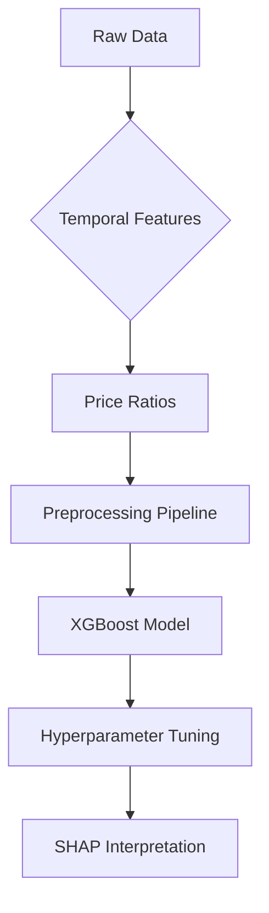

# Advanced Price Elasticity Modeling

## 🚀 Overview
Advanced price elasticity modeling using machine learning with temporal validation and Bayesian hyperparameter optimization. Implements non-linear elasticity estimation through SHAP values interpretation.

## 📌 Key Features
- XGBoost with temporal cross-validation
- Bayesian hyperparameter tuning using Optuna
- SHAP-based price elasticity calculation
- Automated feature engineering pipeline
- Model interpretability visualizations
- Production-ready pipeline packaging

## 📦 Installation

### Requirements
- Python 3.8+
- CUDA 11.0+ (for GPU acceleration)

```bash
pip install -r requirements.txt
```

### 📊 Dataset Preparation
1. Download dataset from [Kaggle Retail Data Analytics](https://www.kaggle.com/datasets/manjeetsingh/retaildataset)
2. Organize files:
   
```
data/
├── raw/
│   ├── sales.csv
│   └── products.csv
└── processed/
```

## Workflow

### 1. Data Processing
```python
from price_elasticity_model import PriceElasticityModel

model = PriceElasticityModel()
model.fit('data/raw/sales.csv', 'data/raw/products.csv')
```

### 2. Model Interpretation
```python
print(f"Price Elasticity: {model.elasticity:.2f}")
model.plot_results()
```

### 3. Prediction
```python
new_data = pd.read_csv('new_data.csv')
predictions = model.predict(new_data)
```

## ⚙ Hyperparameter Space
| Parameter | Search Space | Optimization Method |
|-----------|--------------|----------------------|
| learning_rate | 0.01-0.3 | Bayesian (TPE) |
| max_depth | 3-12 | Int Uniform |
| subsample | 0.6-1.0 | Uniform |
| colsample_bytree | 0.6-1.0 | Uniform |
| gamma | 0-1 | Uniform |
| alpha | 0-10 | Uniform |

## 📈 Results Interpretation
1. **SHAP Values**: Explain feature impacts on predictions
2. **Temporal Validation**: 3-fold time series split
3. **Elasticity Calculation**: 
   ```bash
   Price Elasticity: -1.45 # 1% price ↑ → 1.45% sales ↓
   ```
4. **Output Files**:
   - `model/price_elasticity_model.pkl`: Trained model
   - `results/sales_predictions.png`: Visualization
   - `results/feature_importance.png`: SHAP summary

## 🧠 Model Architecture


## 📄 License
MIT License 
